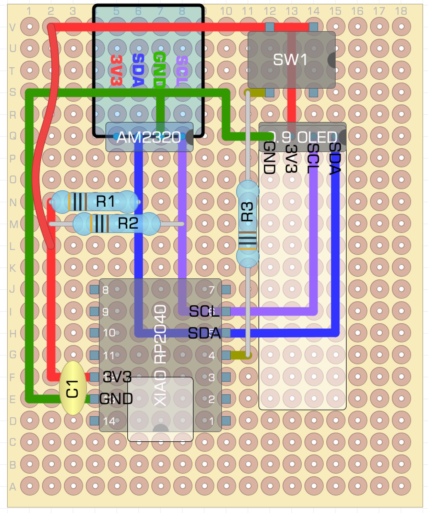
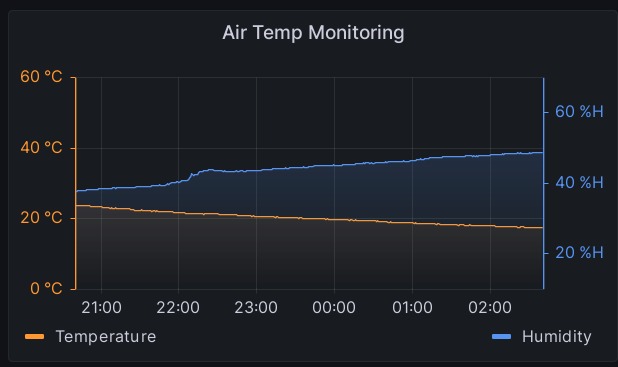

# Simple Temperature & Humidity Monitor

Node-exporter textfile collector for Temp & Humidity readings produced
from the companion firmware.

Requires the [Prometheus Node
Exporter](https://github.com/prometheus/node_exporter) to pass metrics
to the monitoring system.

# Hardware

The hardware device consists of a Raspberry Pico (RP2040) chip on a board
such as the Seeed XIAO RP2040 or the Adafruit Trinkey QT2040, although
the exact form doesn't matter. The board layout included here was for the
XIAO:

   Board layout for Tempmon

The board was designed using [DiyLC](https://bancika.github.io/diy-layout-creator/) which
was simple enough for this type of project. It was constructed on 
copper perfboard, using wires soldered to the board all the way.

## Circuit Outline:

The MCU board is connected to an AM2320 temperature & humidity monitor
using the Pico's I2C bus. Two 3K pullup resistors are required on the
I2C lines.

The device also supports an SSD1306-based 128x32 OLED (of which there
are many sources), and if present it will show the current readings.

The whole unit is connected to the host PC using the USB serial port,
which appears on a Linux host, at least, as /dev/ttyACM?. Consider
using the device links under /dev/serial/by-id/

# Firmware

The device firmware is written in CircuitPython (v8), using the SSD1306,
neopixel, and AM2320 Adafruit libraries (Thanks Adafruit!).

Although there is a fair bit of exception code it is fairly simple
in form: setup the peripherals, then forever loop reading a value, writing
it to the serial port and Neopixel/OLED (if present).

The data is written to the serial port as a JSON dict. It is important to
the host collector that it is all on one line as the collector relies
on the linefeed as a 'packet' separator.

The Seeed XIAO RP2040 includes a Neopixel which the firmware writes a
colour to that reflects (very imperfectly) the measurements.

## Modifications

There is no user-configuration available other than by editing the source:

Update the measurement time interval by changing the STEP value (in
seconds). Changing it below the time taken to do a complete measurement
loop will result in poor results. I suggest a minimum of 1s.

Similarly, adjust `def temp_calib()` and `def humid_calib()` as required
for your specific sensor, or have them return the input value unchanged.

The pins used for I2C are usually defined by the board. If you need to
do software-I2C use the bitbangio module.

## Accuracy

The AM2320 is not marketed as an especially accurate device and has
not shown itself to be so... expect values within about 2 deg C 
and something like 5% RH. I did investigate calibration of my 
particular device and on that basis the firmware adjusts the returned
measurements before passing them on. YMMV.

I have found the relative (minute-on-minute) measurements to reflect
reality with more precision, though: a sequence of readings in a
cooling or warming environment show that cooling or warming properly.

# Software

A simple converter is required to read data from the device's serial
port and write it in the correct format to node\_exporter's 
text\_collector directory.

   A Panel in Grafana showing the results.

The Host collector code is ironically more complex than the firmware,
becuase it has to report `samples` whether or not info is coming on the
serial port, or even if there is no port! This is so it can report the
'up' value, showing whether the data source is present or not.

Most of the reader uses a Stream object to represent either PySerial
or a normal File source, but the stream is either for File or PySerial
selected by command line option -T for PySerial.

Data from the serial port is read in as it comes into a buffer, and
once a whole line is available in the buffer that is extracted and
parsed as Json. The JSON dictionary is then written to a new text file
using wr\_param(), and the whole process restarts.

## Command Line options

    usage: tempmon_collector.py [-h] [-i PORT] [-T] [-b BAUD] [-o PROMFILE] [-O]

    Serial-to-promfile converter for TempMon gadget. See the Prometheus 'node_exporter' for details of textfile-
    collector promfiles. Locate the output file on a tmpfs (memory) file system.

    options:
      -h, --help            show this help message and exit
      -i PORT, --serial PORT
                            Serial port to read
      -T, --tty             Treat input PORT as an OS serial port (default to read as a file)
      -b BAUD, --baud BAUD  Serial port baud rate (only if -T)
      -o PROMFILE, --promfile PROMFILE
                            Full path to promfile to write to
      -O, --stdout          Write results to stdout as well as promfile

    (c) 2023 Ruth Ivimey-Cook

## Systemd Service file

A sample Systemd Service file is provided, which works for me! You should
as a minimum ensure it is calling the collector with the correct device file.

## Collector Installation and Usage

The `node_exporter` listens on HTTP port 9100 by default. See its `--help`
output for more options. One of its options is for a textfile-collector
directory, which if present it will scan for input and when found,
pass on.

By writing a file into this directory in 'Prometheus-metrics' format,
you can thus include it in the node\_exporter output.

## Text-Collector Location

Because the files in this directory are rewritten very frequently and
they are also ephemeral, it is best to put it in a filesystem using the
`tmpfs` filesystem, such as /var/run/node\_exporter/textcollector.

## Example tempmon.prom Output

The promfile created will look something like this. The name prefix
(here 'airtemp_' can be changed using the prefix variable in the source.

    # TYPE airtemp_info gauge
    airtemp_info{name="tempmon",version="1.0",tty="/dev/ttyACM0"}    1.000
    # TYPE airtemp_up gauge
    airtemp_up{}    1.000
    # TYPE airtemp_temp gauge
    airtemp_temp{unit="C"}   18.000
    # TYPE airtemp_humidity gauge
    airtemp_humidity{unit="%"}   47.900
    # TYPE airtemp_uptime gauge
    airtemp_uptime{unit="s"} 1728.000

# Known issues:

* Currently the in the Collector the File source (no -T) is broken
because readline\_partial() wants to use .in\_waiting, which is not
present for Files.

* There is code to read 2 buttons, and one button on the board, but
so far nothing is done with these. Eventually they will be used to
enable/disable the CIRCUITPY mass storage device, and possibly to set
the OLED display mode.

